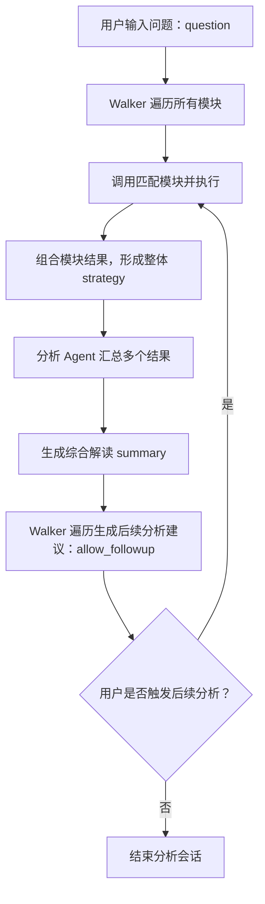
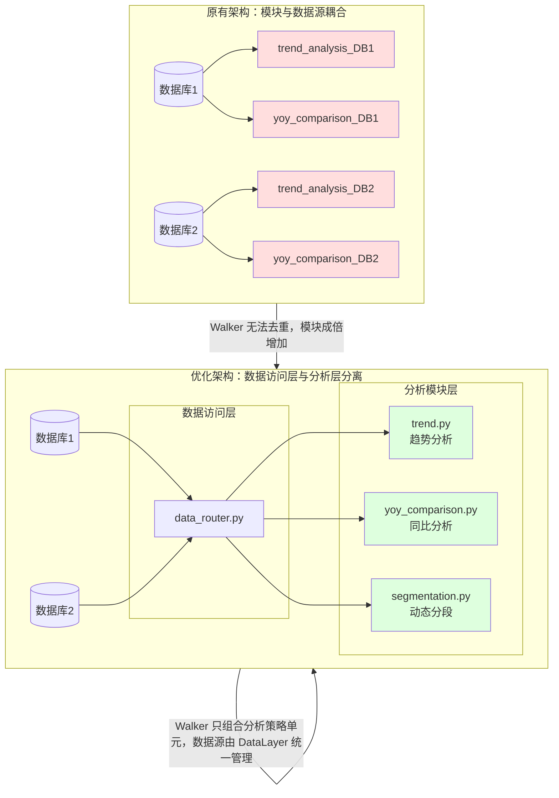
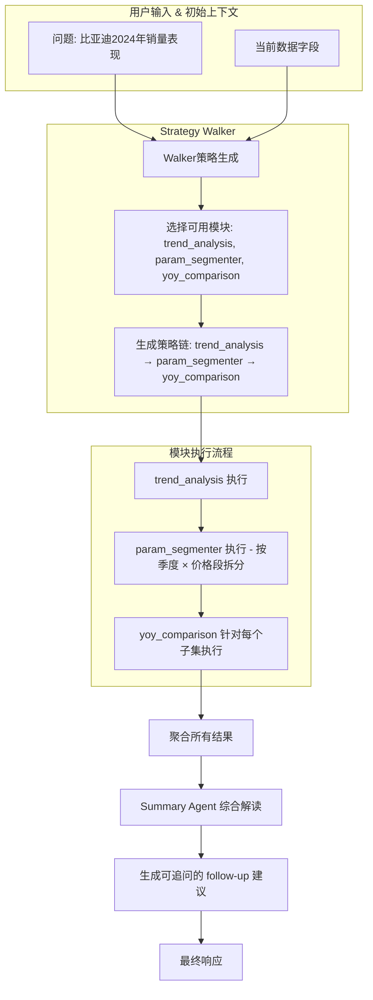
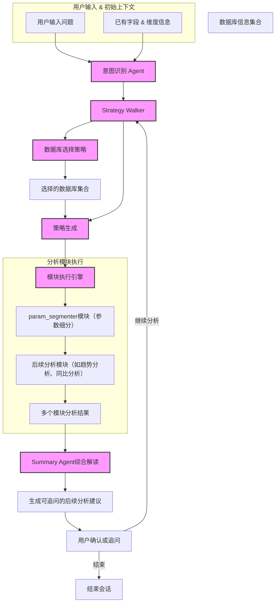

# W33_utils_3 项目架构

本项目 `W33_utils_3` 是一个工具库，主要包含以下模块和文件：

## 目录结构

- `.env`: 环境变量配置文件。
- `.gitignore`: Git 版本控制忽略文件。
- `README.md`: 项目说明文件。
- `agents/`: 可能包含各种智能代理或自动化脚本。
- `core/`: 核心功能模块，可能包含项目的基础类、函数或通用工具。
- `data/`: 数据存储目录，可能包含数据集、配置文件或其他运行时数据。
- `devlog/`: 开发日志或记录。
- `llm/`: 大语言模型相关模块。
  - `glm.py`: 可能包含与 GLM (General Language Model) 相关的实现。
  - `prompts.py`: 可能包含用于 LLM 的提示词定义。
- `modules/`: 其他功能模块，可能包含特定功能的独立组件。
- `pyproject.toml`: Python 项目的构建系统配置，使用 UV 管理依赖和项目元数据。
- `test/`: 测试文件和测试用例，用于验证项目功能的正确性。

## 核心功能（推测）

根据目录结构，本项目可能是一个基于 Python 的工具集合，尤其关注于大语言模型（LLM）相关的应用和开发。`agents` 和 `modules` 目录表明项目可能包含模块化的功能和自动化代理。`core` 目录则承载了项目的核心逻辑和通用工具。

## 安装和使用方法

### 1. 环境准备

```bash
# 创建虚拟环境
python3 -m venv venv

# 激活虚拟环境
source venv/bin/activate  # macOS/Linux
# 或者在 Windows 上使用: venv\Scripts\activate

# 安装依赖
pip install pandas duckdb pyarrow
```

### 2. 数据分析功能

项目提供了自动化的数据分析工具，可以读取 `data/` 目录下的各种格式数据文件：

- **支持的文件格式**：CSV、Parquet、DuckDB
- **分析内容**：数据形状、列信息、缺失值统计、数值列描述统计、文本列基本信息

#### 快速开始

```bash
# 激活虚拟环境
source venv/bin/activate

# 运行数据分析
python run_data_analysis.py
```

#### 编程方式使用

```python
from modules.run_data_describe import DataAnalyzer

# 创建分析器实例
analyzer = DataAnalyzer()

# 分析所有数据文件
analyzer.analyze_all_data()

# 或者指定特定目录
analyzer = DataAnalyzer(data_dir="/path/to/your/data")
analyzer.analyze_all_data()
```

### 3. 项目结构说明

- `modules/run_data_describe.py`：核心数据描述模块，帮助用户理解数据现状
- `run_data_analysis.py`：命令行运行脚本
- `pyproject.toml`：项目依赖和配置
- `data/`：存放待分析的数据文件

# walker



好的，我给你画一个 **多数据库 + 模块分离** 架构的对比图，让你看到“原来的设计”和“分离后的设计”在 Walker 模式下的区别。

---



---

### 📌 图里的重点区别

| 特性                | 原有架构（耦合）            | 分离架构（Walker 友好） |
| ------------------- | --------------------------- | ----------------------- |
| **模块数量**        | 数据源 × 分析逻辑，成倍增加 | 分析逻辑固定数量        |
| **代码重复**        | 高                          | 低（仅数据访问层差异）  |
| **数据源切换**      | 需要复制并改多个模块        | 只改 DataLayer          |
| **Walker 扩展分析** | 需要关心数据库细节          | 只关心策略单元组合      |

---

这样分离之后，Walker 看到的只是**趋势分析**、**同比分析**、**动态分段**等纯分析单元，
它可以组合这些策略去尝试自动分析，不会因为数据源多而把模块列表“放大好几倍”。

---

我建议你下一步就是先做这个 **DataLayer + AnalysisLayer** 分离，
这样无论模块匹配还是 Walker 自动探索都不会受数据库数量影响。

我还可以帮你画一个 **“Walker 自动组合策略”** 的数据流图，
让你看清楚多数据库环境下它是怎么调度的，要画吗？这样你就能直接用作架构升级参考。

## walker 策略架构

对，你这个理解是很合理的。

如果把 **参数细分器** 当作一个独立的分析模块（而不是 Walker 内部的硬编码逻辑），有几个好处：

---

### 1. **模块解耦**

- 参数细分（时间 × 品类 × 价格段等）不嵌进 Walker 核心逻辑，而是以一个普通的模块形式注册到 `modules/`。
- 这样 Walker 在执行时，只是“把它放进策略链路”，不关心它内部是做参数生成还是做计算。
- 好处：

  - Walker 更通用，只负责策略安排。
  - 参数细分器可以单独测试、升级、替换。

---

### 2. **同层级运行**

- 例如：

  ```
  Strategy = [trend_analysis, param_segmenter, yoy_comparison]
  ```

  - `trend_analysis` 先跑趋势
  - `param_segmenter` 输出子问题（按季度、价格段拆分）
  - `yoy_comparison` 针对子问题做同比

- 这就等于 Walker 在“模块序列”里夹了一个细分器，让它去丰富后续模块的输入。

---

### 3. **Summary 更丰富**

- 因为参数细分器的输出是“多个变体数据集”，后续模块在不同切片上跑，得到的结果粒度更细。
- Summary Agent 就能拼接出一个更有洞察力的整体结论（类似 BI 工具里的 Drill-down）。

---

### 4. **Walker + 模块化设计的好处**

- Walker 不变，扩展能力靠加模块。
- “细分器”只是 Walker 能调度的众多模块之一。
- 未来还可以有：

  - 数据清洗模块
  - 异常检测模块
  - 预测模块
  - 信号聚合模块

- 这些都是“策略单元”，Walker 只是挑选和组合。

---

如果你愿意，我可以帮你画一个 **Walker 执行两种模块的流程图**（分析模块 + 参数细分模块），能清楚展示你说的“同层级”运行方式。
这样你就可以在 devlog 里解释给团队看，避免他们把参数细分硬绑进 Walker 里。

你要我画吗？

好的，这是你说的 **“参数细分模块与分析模块同层级运行”** 的 Walker 策略流程图：



---

### 关键设计点

1. **param_segmenter** 只是一个 Walker 可调度的普通模块，和 trend_analysis、yoy_comparison 平级。
2. **Walker 策略链** 里可以把它放在任何位置（甚至多个位置），完全由策略引擎决定。
3. **Execution 阶段** 里，param_segmenter 的输出直接成为后续模块的输入，而不是回到 Walker 再重新调度。
4. **Summary Agent** 负责把多粒度结果合并成一个有洞察的结论，并生成后续分析建议。

---

我建议你在 **base_module.py** 里也为这种“细分器”定义标准接口，比如：

```python
class BaseAnalysisModule(ABC):
    module_id: str
    module_name: str
    description: str

    @abstractmethod
    def run(self, data, **params) -> dict:
        """执行分析，返回结构化结果"""

    @abstractmethod
    def get_requirements(self) -> dict:
        """声明所需数据字段和参数"""
```

这样不管它是做分析还是做切片，都能保证在 Walker 流程里稳定运行。

---

我可以帮你再画一个 **Walker 策略 + 多数据库选择 + 参数细分器** 的版本，这样你的团队就能直接对接未来扩展。
你要做吗？这样就一步到位。

明白！我帮你设计一个结合 Walker 策略、多数据库选择、参数细分模块的全流程示意图，展示整个智能分析执行路径：



---

### 说明

- **意图识别 Agent** 提取用户核心需求。
- **Strategy Walker** 不仅根据意图和模块，还结合**数据库信息**决定“在哪查数据”。
- **数据库选择策略** 是 Walker 的一部分，动态决定要用哪些数据源。
- **参数细分模块**是一个普通模块，执行后输出细分后的数据，供后续模块使用。
- 多模块可**串联执行**，输出结果统一给 Summary Agent。
- Summary Agent 负责跨模块结果的综合解读，生成面向用户的总结与后续建议。
- 用户通过反馈决定是否进入新一轮 Walker 策略分析，形成闭环。

---

如果需要，我也可以帮你写对应的基础骨架代码和模块接口设计，方便落地！你觉得怎么样？
