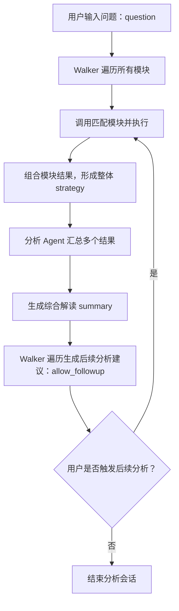
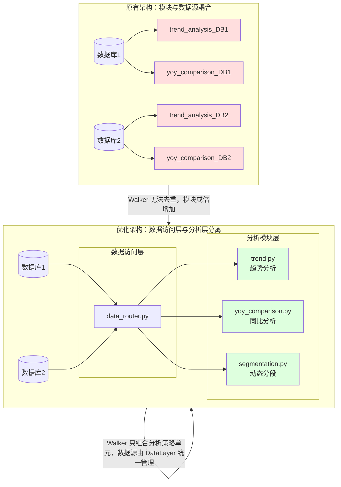

# W33_utils_3 项目架构

本项目 `W33_utils_3` 是一个工具库，主要包含以下模块和文件：

## 目录结构

- `.env`: 环境变量配置文件。
- `.gitignore`: Git 版本控制忽略文件。
- `README.md`: 项目说明文件。
- `agents/`: 可能包含各种智能代理或自动化脚本。
- `core/`: 核心功能模块，可能包含项目的基础类、函数或通用工具。
- `data/`: 数据存储目录，可能包含数据集、配置文件或其他运行时数据。
- `devlog/`: 开发日志或记录。
- `llm/`: 大语言模型相关模块。
  - `glm.py`: 可能包含与 GLM (General Language Model) 相关的实现。
  - `prompts.py`: 可能包含用于 LLM 的提示词定义。
- `modules/`: 其他功能模块，可能包含特定功能的独立组件。
- `pyproject.toml`: Python 项目的构建系统配置，使用 UV 管理依赖和项目元数据。
- `test/`: 测试文件和测试用例，用于验证项目功能的正确性。

## 核心功能（推测）

根据目录结构，本项目可能是一个基于 Python 的工具集合，尤其关注于大语言模型（LLM）相关的应用和开发。`agents` 和 `modules` 目录表明项目可能包含模块化的功能和自动化代理。`core` 目录则承载了项目的核心逻辑和通用工具。

## 安装和使用方法

### 1. 环境准备

```bash
# 创建虚拟环境
python3 -m venv venv

# 激活虚拟环境
source venv/bin/activate  # macOS/Linux
# 或者在 Windows 上使用: venv\Scripts\activate

# 安装依赖
pip install pandas duckdb pyarrow
```

### 2. 数据分析功能

项目提供了自动化的数据分析工具，可以读取 `data/` 目录下的各种格式数据文件：

- **支持的文件格式**：CSV、Parquet、DuckDB
- **分析内容**：数据形状、列信息、缺失值统计、数值列描述统计、文本列基本信息

#### 快速开始

```bash
# 激活虚拟环境
source venv/bin/activate

# 运行数据分析
python run_data_analysis.py
```

#### 编程方式使用

```python
from modules.run_data_describe import DataAnalyzer

# 创建分析器实例
analyzer = DataAnalyzer()

# 分析所有数据文件
analyzer.analyze_all_data()

# 或者指定特定目录
analyzer = DataAnalyzer(data_dir="/path/to/your/data")
analyzer.analyze_all_data()
```

### 3. 项目结构说明

- `modules/run_data_describe.py`：核心数据描述模块，帮助用户理解数据现状
- `run_data_analysis.py`：命令行运行脚本
- `pyproject.toml`：项目依赖和配置
- `data/`：存放待分析的数据文件

# walker



好的，我给你画一个 **多数据库 + 模块分离** 架构的对比图，让你看到“原来的设计”和“分离后的设计”在 Walker 模式下的区别。

---



---

### 📌 图里的重点区别

| 特性                | 原有架构（耦合）            | 分离架构（Walker 友好） |
| ------------------- | --------------------------- | ----------------------- |
| **模块数量**        | 数据源 × 分析逻辑，成倍增加 | 分析逻辑固定数量        |
| **代码重复**        | 高                          | 低（仅数据访问层差异）  |
| **数据源切换**      | 需要复制并改多个模块        | 只改 DataLayer          |
| **Walker 扩展分析** | 需要关心数据库细节          | 只关心策略单元组合      |

---

这样分离之后，Walker 看到的只是**趋势分析**、**同比分析**、**动态分段**等纯分析单元，
它可以组合这些策略去尝试自动分析，不会因为数据源多而把模块列表“放大好几倍”。

---

我建议你下一步就是先做这个 **DataLayer + AnalysisLayer** 分离，
这样无论模块匹配还是 Walker 自动探索都不会受数据库数量影响。

我还可以帮你画一个 **“Walker 自动组合策略”** 的数据流图，
让你看清楚多数据库环境下它是怎么调度的，要画吗？这样你就能直接用作架构升级参考。
