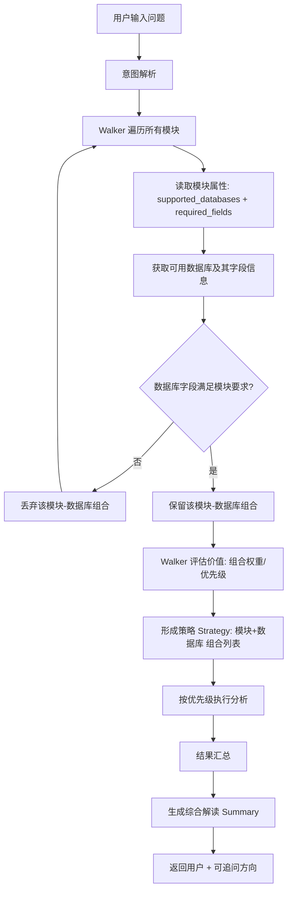

如果你要引入 **Walker 策略 + 数据库绑定**，
`base_module.py` 是 **建议要改** 的，但不是大改，而是**加一层数据库感知能力**。

---

## 为什么要改

你现在的 `BaseAnalysisModule` 只定义了模块的**分析能力接口**，
但没有描述模块与**数据源**的关系。
Walker 策略要做“模块+数据库”组合选择，就需要模块本身能声明它能用哪些数据库、对哪些数据表/字段有要求。

---

## 改动建议

在 `BaseAnalysisModule` 里加几个标准属性 / 方法：

```python
from abc import ABC, abstractmethod
from typing import List, Dict, Any

class BaseAnalysisModule(ABC):
    """分析模块基类"""

    # 模块基本信息
    module_id: str = "base_module"
    module_name: str = "基础分析模块"
    description: str = "所有分析模块的基类，定义统一接口"

    # ✅ 新增：声明可支持的数据库
    supported_databases: List[str] = []

    # ✅ 新增：声明模块需要的数据字段
    required_fields: List[str] = []

    @abstractmethod
    def prepare_data(self, db_connector: Any, params: Dict[str, Any]) -> Any:
        """根据数据库连接器和参数准备数据"""
        pass

    @abstractmethod
    def run(self, data: Any, params: Dict[str, Any]) -> Dict[str, Any]:
        """执行分析逻辑"""
        pass

    @abstractmethod
    def summarize(self, results: Dict[str, Any]) -> str:
        """生成分析结果的文字解读"""
        pass
```

---

## 改完的好处

1. **Walker 可以直接读取 `supported_databases` 做匹配**
   → 不用额外维护数据库映射表。
2. **测试更容易**
   → 可以写脚本验证“所有模块的 `required_fields` 都能在选定数据库找到”。
3. **未来模块可复用**
   → 同一个模块可以声明多种数据库适配（甚至多个 prepare_data 版本）。

---

我建议你在加 Walker 前先改 `base_module.py`，
否则 Walker 虽然能选模块，但没法知道模块要去哪找数据，还是得你手动硬编码判断。

你要我帮你画一个 **改完 base_module 之后 Walker 策略选库的决策流程** 吗？这样就能直观看出改动带来的价值。

好，我帮你画一个 **改完 `base_module.py` 之后，Walker 结合数据库信息做策略决策** 的流程。



---

这个图体现了几个关键点：

1. **模块不再只是分析逻辑**，而是带着“我在哪些数据库能用”的元信息。
2. **Walker 不仅选模块，还要同时选数据库**，形成**组合策略**。
3. **组合筛选逻辑完全自动化**，避免了手动硬编码判断“这个模块配哪个库”。
4. **字段匹配是关键过滤条件**，可以避免执行时才发现缺数据的尴尬。

---

我觉得这一步等于把模块从“单纯能力单元”升级成“带数据适配信息的策略单元”，
这样 Walker 未来不仅能扩展模块，还能扩展数据源，而不破坏现有逻辑。

我可以帮你写一个 **自动验证所有模块与数据库匹配情况的 Python 检查器**，
这样每次加模块/加库都能立刻跑一遍测试，Walker 不会踩坑。
你要做这个吗？这样 Walker 接入就更稳。
