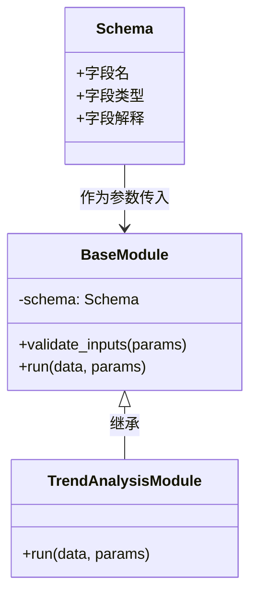

## Walker 系统模块架构与数据库关系分析

### 🏗️ 核心架构关系

**三层架构设计：**

1. **配置层** - <mcfile name="analysis_config.json" path="/Users/zihao_/Documents/github/W33_utils_3/modules/analysis_config.json"></mcfile>
2. **抽象层** - <mcfile name="base_module.py" path="/Users/zihao_/Documents/github/W33_utils_3/modules/base_module.py"></mcfile>
3. **实现层** - <mcfile name="data_describe_module.py" path="/Users/zihao_/Documents/github/W33_utils_3/modules/data_describe_module.py"></mcfile>

### 📋 analysis_config.json - 模块注册中心

**作用：**

- 系统模块的**统一配置文件**，定义所有可用分析模块
- 包含模块元数据：ID、名称、描述、类名、文件路径
- 声明数据库兼容性：`supported_databases: ["csv", "parquet", "duckdb", "sqlite"]`
- 定义参数要求：`data_source`（必需）、`include_visualization`（可选）

**与数据库关系：**

- 通过`supported_databases`字段声明支持的数据源类型
- 系统启动时读取此配置，动态加载对应模块

### 🧬 base_module.py - 统一接口标准

**核心功能：**

- 定义<mcsymbol name="BaseAnalysisModule" filename="base_module.py" path="/Users/zihao_/Documents/github/W33_utils_3/modules/base_module.py" startline="11" type="class"></mcsymbol>抽象基类
- 实现**数据库感知能力**：`supported_databases`、`required_fields`、`optional_fields`
- 提供三步式分析流程：`prepare_data()` → `run()` → `summarize()`
- 兼容性检查：<mcsymbol name="check_database_compatibility" filename="base_module.py" path="/Users/zihao_/Documents/github/W33_utils_3/modules/base_module.py" startline="180" type="function"></mcsymbol>

**与数据库关系：**

- 抽象化数据库访问接口，支持多种数据源
- 通过`db_connector`参数接收数据库连接器
- 动态检测数据字段兼容性，计算兼容性评分

### 🔍 data_describe_module.py - 具体实现

**实现特点：**

- 继承<mcsymbol name="BaseAnalysisModule" filename="base_module.py" path="/Users/zihao_/Documents/github/W33_utils_3/modules/base_module.py" startline="11" type="class"></mcsymbol>，实现数据描述分析功能
- **万能兼容性**：`required_fields = []`，可分析任何数据结构
- 动态字段检测：`_detected_fields`属性存储运行时发现的字段
- 多格式支持：CSV、Parquet、DuckDB、SQLite

**与数据库关系：**

- 通过<mcsymbol name="prepare_data" filename="data_describe_module.py" path="/Users/zihao_/Documents/github/W33_utils_3/modules/data_describe_module.py" startline="95" type="function"></mcsymbol>方法处理不同数据源
- 支持文件路径、目录路径、数据库表名等多种输入
- 集成<mcfile name="run_data_describe.py" path="/Users/zihao_/Documents/github/W33_utils_3/modules/run_data_describe.py"></mcfile>的 DataAnalyzer 类

### 🗄️ 与 data/目录的关系

**数据流向：**

```
data/ 目录 → DataAnalyzer → data_describe_module → Walker → Router → 用户界面
```

**具体机制：**

1. **自动发现**：DataAnalyzer 扫描 data/目录下的所有支持文件
2. **格式识别**：根据文件扩展名(.csv, .parquet, .duckdb)选择读取方法
3. **数据准备**：prepare_data()方法将文件转换为 DataFrame 或字典格式
4. **兼容性评估**：check_database_compatibility()评估模块与数据的匹配度
5. **分析执行**：run()方法对准备好的数据执行描述性统计

### 🔄 系统工作流程

1. **启动阶段**：系统读取 analysis_config.json，注册所有模块
2. **请求阶段**：用户提出数据分析需求
3. **匹配阶段**：Walker 根据数据源和模块兼容性选择最佳模块
4. **执行阶段**：模块通过 base_module 定义的接口访问 data/目录数据
5. **响应阶段**：返回标准化的分析结果

### 💡 设计优势

- **可扩展性**：新增模块只需继承 BaseAnalysisModule 并更新 config.json
- **数据库无关性**：统一接口支持多种数据源，无需修改业务逻辑
- **智能匹配**：自动评估模块与数据的兼容性，选择最优分析策略
- **标准化输出**：所有模块返回统一格式的结果，便于后续处理

我给你画了一个简洁的类关系和数据流示意图，帮你理清「Schema - BaseModule - 子模块」的关系：



---

### 数据流说明

1. **外部系统**（比如数据库或数据文件）提供数据及其对应的 **Schema** 描述
2. **Schema** 作为参数传给 **BaseModule**（和其子模块）
3. **TrendAnalysisModule** 继承自 **BaseModule**，利用 Schema 来验证和解释数据字段，执行趋势分析
4. 分析结果返回给系统其他模块（如 Walker、Router）进行后续处理或用户呈现

---

如果你需要，我还能帮你设计一个具体的模块构造函数和调用示范，或者帮你写个 README 说明文档模板，方便你团队理解和使用。需要吗？
