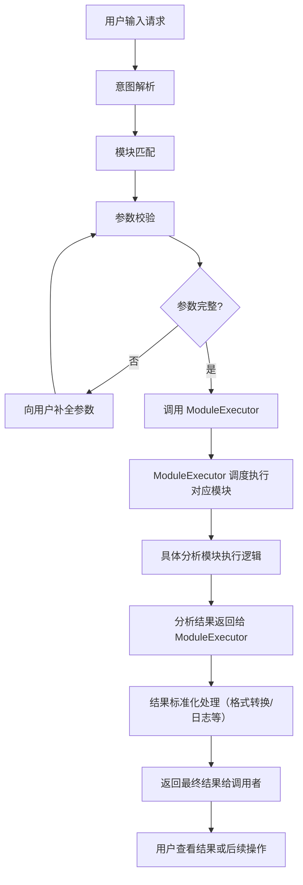

好的，帮你画个简洁明了的模块执行调度流程图，理清 **用户请求 → 意图解析 → 模块匹配 → 参数校验 → ModuleExecutor 调度执行模块 → 返回结果** 的关系。

### 说明：

- **ModuleExecutor** 是调度中心，负责调用具体分析模块并统一处理返回结果。
- 各个分析模块（如趋势分析、同比分析）专注自己的业务逻辑实现。
- 用户交互流程包括参数检查和补全，保证模块执行的输入完整准确。
- 执行流程中可灵活插入日志、异常处理、缓存等机制，集中管理。

如果要，我也能帮你做更详细的交互流程图或者具体代码示例。需要吗？
