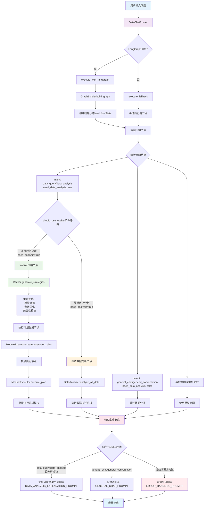
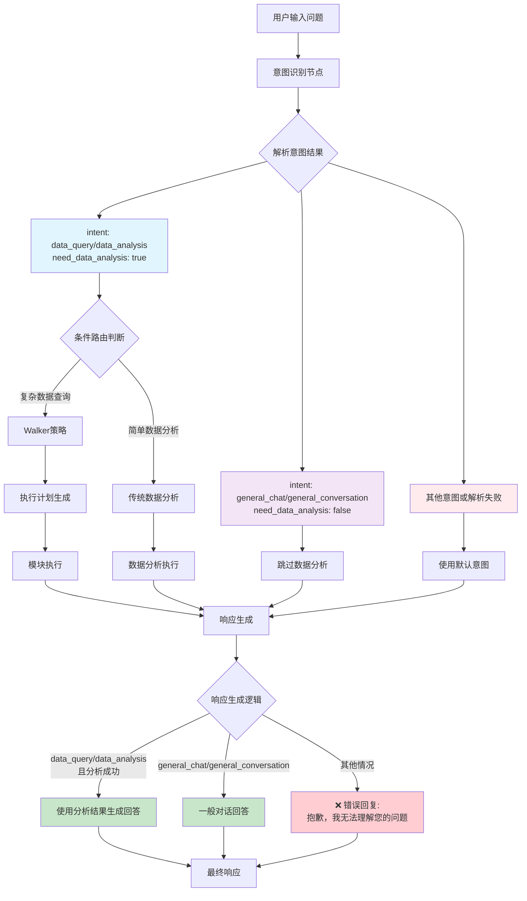
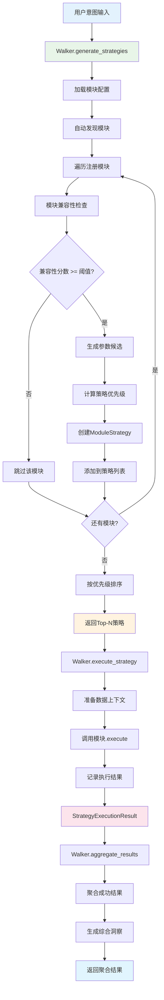
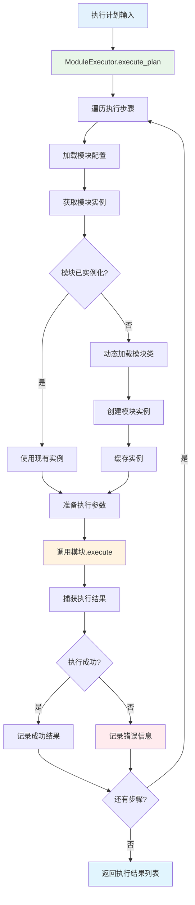
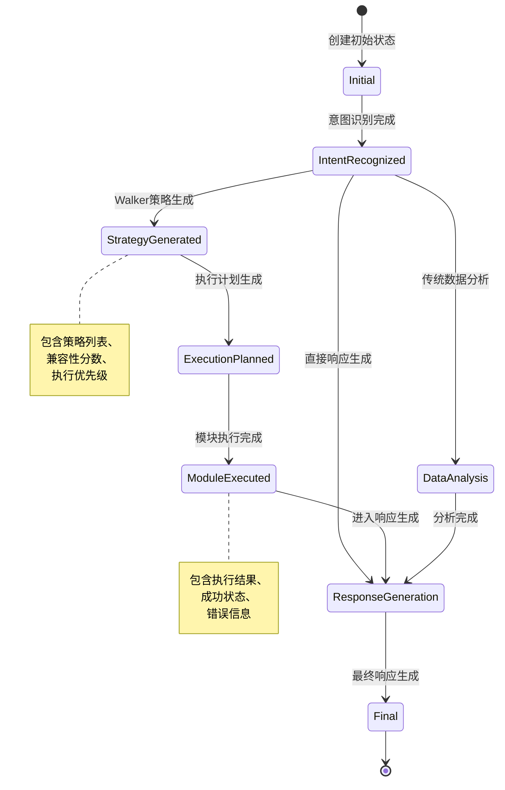

# 数据聊天系统工作流设计文档

## 问题分析

在 Terminal#1002-1027 的日志中，我们看到：

- 意图识别返回：`'intent': 'general_conversation'`
- 但 `response_generation_node` 中只处理 `'general_chat'`
- 导致进入 `else` 分支，返回错误信息

## 修复方案

已修改 `response_generation_node` 中的条件判断，支持 `general_conversation` 意图。

## 整体系统架构

### 核心模块关系表

| 模块名称           | 文件路径                       | 主要职责                                       | 依赖关系                                  | 关键方法                                                                    |
| ------------------ | ------------------------------ | ---------------------------------------------- | ----------------------------------------- | --------------------------------------------------------------------------- |
| **DataChatRouter** | `core/router.py`               | 系统主控入口，接收用户输入并协调整个工作流     | GraphBuilder                              | `process_user_question()`, `execute_with_langgraph()`, `execute_fallback()` |
| **GraphBuilder**   | `core/graph_builder.py`        | 构建和管理 LangGraph 状态图，定义工作流节点    | Walker, ModuleExecutor, DataAnalyzer, GLM | `build_graph()`, `recognize_intent_node()`, `walker_strategy_node()`        |
| **Walker**         | `core/walker.py`               | 策略生成和执行协调器，根据意图生成最优分析策略 | ModuleExecutor, 分析模块                  | `generate_strategies()`, `execute_strategy()`, `aggregate_results()`        |
| **ModuleExecutor** | `agents/module_executor.py`    | 模块执行器，负责加载和执行具体的分析模块       | 分析模块配置                              | `load_module_from_config()`, `get_module_instance()`, `execute_plan()`      |
| **DataAnalyzer**   | `modules/run_data_describe.py` | 传统数据分析执行器（备用方案）                 | DataDescribeModule                        | `analyze_all_data()`                                                        |
| **GLM Client**     | `llm/glm.py`                   | 大语言模型客户端，处理意图识别和响应生成       | -                                         | `parse_json_response()`, `generate_response()`                              |

### 工作流状态定义

```python
class WorkflowState(TypedDict):
    user_question: str                    # 用户问题
    intent_result: Dict[str, Any]         # 意图识别结果
    analysis_result: str                  # 分析结果
    analysis_success: bool                # 分析是否成功
    final_response: str                   # 最终响应
    error_message: str                    # 错误信息
    walker_strategy: Dict[str, Any]       # Walker策略
    execution_plan: List[Dict[str, Any]]  # 执行计划
    execution_results: List[Dict[str, Any]] # 执行结果
```

## 完整系统工作流程图



## 意图识别阶段详细流程图



## Walker 策略生成详细流程图



## 模块执行器详细流程图



## 数据流和状态管理

### WorkflowState 状态流转



## 关键问题点

1. **意图不匹配**：意图识别返回 `general_conversation`，但代码只处理 `general_chat`
2. **条件判断缺陷**：`response_generation_node` 中的 `elif` 条件不够全面
3. **默认处理逻辑**：未匹配的意图会进入错误处理分支

## 修复后的流程

现在 `general_conversation` 意图也会正确进入一般对话处理逻辑，避免返回错误信息。

## 系统特性总结

### 核心优势

1. **智能策略生成**：Walker 根据用户意图和数据特征自动选择最优分析策略
2. **模块化设计**：支持动态加载和执行不同的分析模块
3. **兼容性检查**：自动检查模块与数据源的兼容性
4. **降级机制**：LangGraph 不可用时自动切换到传统执行模式
5. **状态管理**：完整的工作流状态跟踪和错误处理

### 扩展性

- **新增模块**：通过配置文件即可注册新的分析模块
- **策略优化**：支持自定义优先级计算和参数生成逻辑
- **结果聚合**：支持多模块结果的智能聚合和洞察生成
- **后续策略**：根据执行结果自动生成后续分析建议
