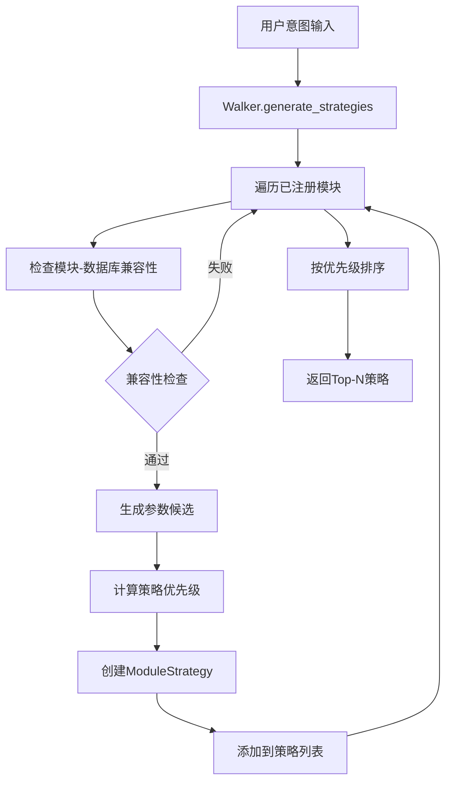
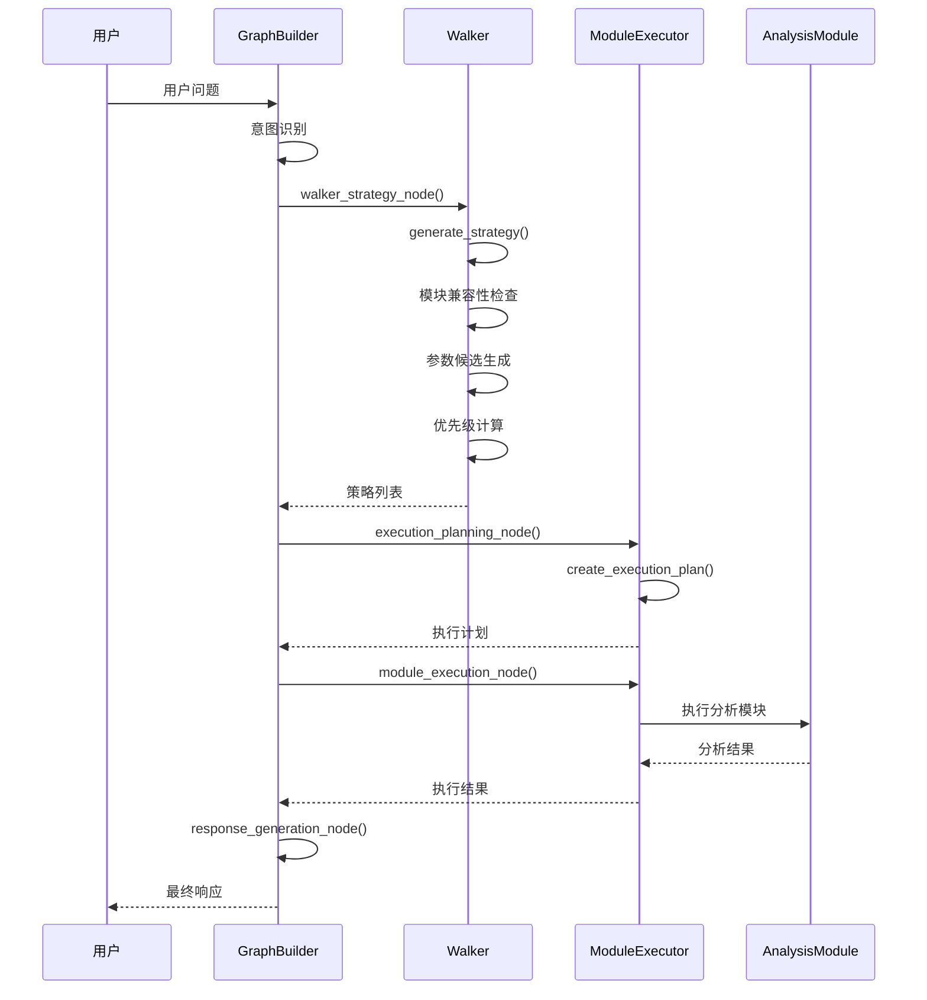
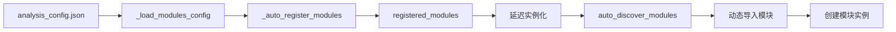
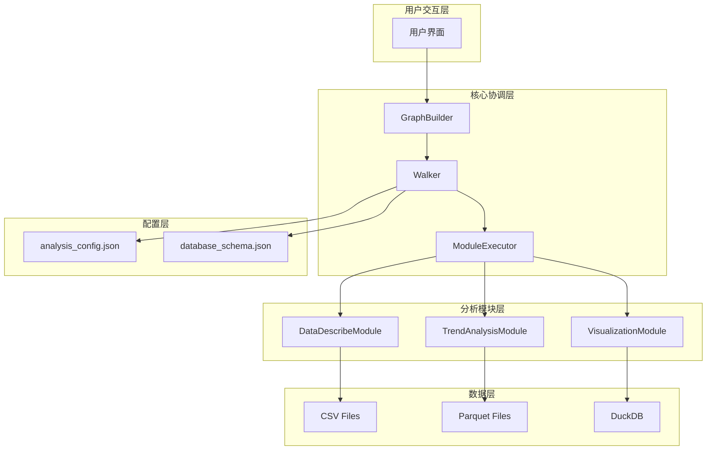

# Walker 模块架构分析与设计文档

## 概述

Walker 是 W33_utils_3 项目的核心策略生成和执行协调器，负责根据用户意图、可用分析模块和数据库资源，智能生成最优的分析策略组合。本文档基于实际代码分析，详细说明 Walker 的架构设计、策略生成机制和与其他模块的协作关系。

## 核心架构

### 1. 数据结构定义

#### ModuleStrategy (策略单元)
```python
@dataclass
class ModuleStrategy:
    module_id: str                    # 模块标识
    module_name: str                  # 模块名称
    module_instance: Any              # 模块实例
    parameters: Dict[str, Any]        # 执行参数
    database_info: Dict[str, Any]     # 数据库信息
    compatibility_score: float        # 兼容性分数
    priority: int = 0                 # 优先级
    estimated_execution_time: float = 0.0  # 预估执行时间
    dependencies: List[str] = None    # 依赖关系
```

#### StrategyExecutionResult (执行结果)
```python
@dataclass
class StrategyExecutionResult:
    strategy: ModuleStrategy          # 对应策略
    success: bool                     # 执行状态
    result: Dict[str, Any]           # 执行结果
    execution_time: float            # 实际执行时间
    error_message: Optional[str] = None  # 错误信息
    insights: List[str] = None       # 分析洞察
```

### 2. Walker 类核心功能

#### 初始化与配置
- **模块配置加载**: 从 `modules/analysis_config.json` 加载模块元数据
- **自动模块注册**: 基于配置文件自动发现和注册分析模块
- **数据库设置**: 支持多种数据源（CSV、Parquet、DuckDB等）
- **延迟实例化**: 模块实例按需创建，提高启动性能

#### 策略生成流程



#### 优先级计算算法

策略优先级由三个维度计算（总分100分）：

1. **兼容性分数** (0-50分): `compatibility_score * 50`
2. **意图匹配度** (0-30分): 基于关键词匹配计算
3. **参数完整度** (0-20分): 必需参数满足程度

```python
def _calculate_strategy_priority(self, module_info, user_intent, compatibility, params):
    priority = 0
    priority += int(compatibility['score'] * 50)  # 兼容性权重
    priority += int(self._calculate_intent_match(module_info, user_intent) * 30)  # 意图匹配
    priority += int(self._calculate_parameter_completeness(module_info, params) * 20)  # 参数完整度
    return priority
```

## 与 Graph Builder 的协作关系

### 工作流状态定义

```python
class WorkflowState(TypedDict):
    user_question: str                # 用户问题
    intent_result: Dict[str, Any]     # 意图识别结果
    walker_strategy: Dict[str, Any]   # Walker策略
    execution_plan: List[Dict[str, Any]]  # 执行计划
    execution_results: List[Dict[str, Any]]  # 执行结果
    analysis_result: str              # 分析结果
    final_response: str               # 最终响应
```

### 协作流程图



### 条件路由逻辑

```python
def should_use_walker(self, state: WorkflowState) -> str:
    intent_result = state.get("intent_result", {})
    need_analysis = intent_result.get("need_data_analysis", False)
    intent = intent_result.get("intent", "general_chat")
    
    if need_analysis and intent in ["data_query", "data_analysis"]:
        return "walker_strategy"  # 使用Walker智能策略
    elif need_analysis:
        return "data_analysis"    # 使用传统分析
    else:
        return "response_generation"  # 直接响应
```

## 策略生成机制详解

### 1. 模块发现与注册



### 2. 兼容性检查机制

```python
def _check_module_database_compatibility(self, module_instance, db_info):
    db_type = db_info.get('type', '')
    available_fields = db_info.get('fields', [])
    return module_instance.check_database_compatibility(db_type, available_fields)
```

### 3. 参数候选生成

- **基础参数**: 从数据库信息和用户意图提取
- **参数组合**: 根据模块参数要求生成多种组合
- **布尔参数**: 自动生成 True/False 两种候选
- **默认值处理**: 使用模块定义的默认参数值

## 下游消费模式

### 1. ModuleExecutor 消费

```python
class ModuleExecutor:
    def create_execution_plan(self, walker_strategy):
        """根据Walker策略创建执行计划"""
        strategies = walker_strategy.get("strategies", [])
        execution_plan = []
        for strategy in strategies:
            plan_step = {
                "module_id": strategy["module_id"],
                "parameters": strategy["parameters"],
                "database_info": strategy["database_info"]
            }
            execution_plan.append(plan_step)
        return execution_plan
```

### 2. 策略执行与结果聚合

```python
def execute_strategies(self, strategies: List[ModuleStrategy]):
    """批量执行策略"""
    results = []
    for strategy in strategies:
        result = self.execute_strategy(strategy)
        results.append(result)
    return results

def aggregate_results(self, results: List[StrategyExecutionResult]):
    """聚合执行结果"""
    return {
        'success': len([r for r in results if r.success]) > 0,
        'aggregated_insights': [insight for r in results for insight in r.insights],
        'total_execution_time': sum(r.execution_time for r in results),
        'summary': self._generate_aggregated_summary(results)
    }
```

## 后续策略生成

### 智能跟进机制

```python
def generate_followup_strategies(self, execution_results, user_feedback=None):
    """根据执行结果生成后续策略"""
    followup_strategies = []
    
    for result in execution_results:
        # 检查可视化需求
        if 'visualization' in result.result and not result.result['visualization']:
            viz_strategies = self.generate_strategies(viz_intent, max_strategies=2)
            followup_strategies.extend(viz_strategies)
        
        # 检查数据清洗需求
        if any('缺失值' in insight for insight in result.insights):
            cleaning_strategies = self.generate_strategies(cleaning_intent, max_strategies=1)
            followup_strategies.extend(cleaning_strategies)
    
    return followup_strategies
```

## 系统集成架构



## 技术特性

### 1. 智能策略生成
- **多维度评分**: 兼容性、意图匹配、参数完整度
- **动态参数组合**: 根据模块要求自动生成参数候选
- **优先级排序**: 确保最优策略优先执行

### 2. 灵活的模块管理
- **配置驱动**: 通过JSON配置文件管理模块
- **延迟加载**: 按需实例化，提高性能
- **热插拔**: 支持动态添加新的分析模块

### 3. 强大的执行控制
- **批量执行**: 支持多策略并行执行
- **结果聚合**: 智能合并多个分析结果
- **错误处理**: 完善的异常处理和降级机制

### 4. 智能跟进
- **结果分析**: 基于执行结果推荐后续分析
- **用户反馈**: 支持用户反馈驱动的策略调整
- **自适应学习**: 根据历史执行情况优化策略生成

## 总结

Walker 模块作为 W33_utils_3 项目的核心策略引擎，通过智能的模块发现、兼容性检查、参数生成和优先级计算，实现了从用户意图到具体分析执行的自动化映射。与 GraphBuilder 的紧密协作，形成了完整的智能数据分析工作流，为用户提供了高效、灵活的数据分析体验。

其设计充分体现了现代软件架构的核心原则：
- **单一职责**: Walker专注策略生成，ModuleExecutor专注执行
- **开放封闭**: 易于扩展新模块，无需修改核心逻辑
- **依赖倒置**: 通过接口和配置实现松耦合
- **智能化**: 基于多维度评分的智能决策机制
