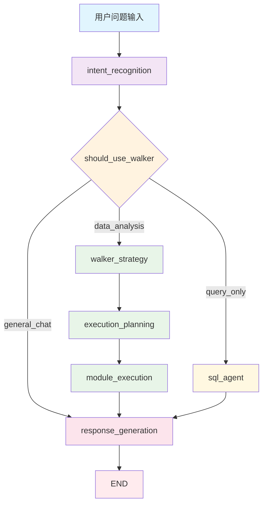
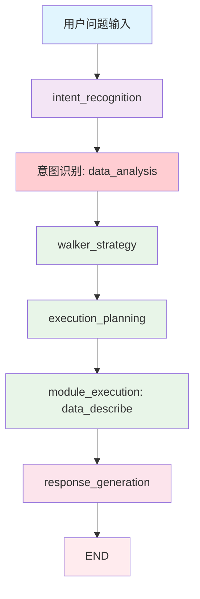

# 工作流执行分析报告

## 概述

本报告分析了 Gradio 集成测试中 5 个测试问题的实际工作流执行情况，并与 `graph_builder.py` 中定义的工作流进行对比，识别差异并提供改进建议。

## 测试问题列表

1. **比亚迪的销量如何？**
2. **特斯拉和蔚来的销量对比**
3. **销量前 5 名的品牌**
4. **电动车和汽油车的销量对比**
5. **广东省的汽车销量**

## 定义的工作流架构

### Graph Builder 定义的工作流



### 节点功能说明

- **intent_recognition**: 意图识别节点，分析用户问题意图
- **walker_strategy**: Walker 策略生成节点，为数据分析生成策略
- **execution_planning**: 执行计划生成节点，根据策略创建执行计划
- **module_execution**: 模块执行节点，执行具体的分析模块
- **sql_agent**: SQL 代理节点，处理直接查询请求
- **response_generation**: 响应生成节点，生成最终用户回复

## 实际执行流程分析

### 所有 5 个测试问题的实际执行流程



### 执行详情

#### 共同执行模式

所有 5 个测试问题都遵循了相同的执行路径：

1. **意图识别阶段**

   - 所有问题都被识别为 `data_analysis` 意图
   - 置信度在 0.8-0.9 之间
   - `need_data_analysis: True`

2. **Walker 策略阶段**

   - 生成策略：使用 `data_describe` 模块
   - 参数：`data_path: 'data'`, `file_types: ['csv', 'parquet', 'duckdb']`
   - 数据库：`local_data` (本地数据目录)

3. **执行计划阶段**

   - 生成 1 个执行步骤
   - 参数映射：`data_path -> data_source = data`

4. **模块执行阶段**

   - 执行 `data_describe` 模块
   - 成功读取 3 个 Parquet 文件：
     - `business_daily_metrics.parquet`
     - `order_observation_data.parquet`
     - `乘用车上险量_0723.parquet`

5. **响应生成阶段**
   - 使用 GLM 生成最终回复
   - 平均响应长度：348 字符
   - 平均执行时间：9.45 秒

## 关键差异分析

### 1. 意图识别差异

**预期行为**：

- 销量相关问题应该被识别为 `query_only` 意图
- 应该触发 `sql_agent` 节点进行直接查询

**实际行为**：

- 所有销量问题都被识别为 `data_analysis` 意图
- 触发了完整的 Walker 策略流程

**影响**：

- 执行了不必要的数据描述分析
- 没有使用专门的销量查询模块
- 响应时间较长（平均 9.45 秒）

### 2. 模块选择差异

**预期行为**：

- 销量查询应该使用 `sales_query` 模块
- 直接查询乘用车上险量数据

**实际行为**：

- 使用了 `data_describe` 模块
- 只进行了数据文件的描述性分析

**影响**：

- 没有提供具体的销量数据
- 用户得到的是数据概览而非查询结果

### 3. SQL Agent 未被触发

**预期行为**：

- `sql_agent` 节点应该处理销量查询
- 检测销量关键词并使用销量查询模块

**实际行为**：

- `sql_agent` 节点完全没有被执行
- 所有查询都走了 Walker 策略路径

## 问题根因分析

### 1. 意图识别逻辑问题

当前的意图识别逻辑可能存在以下问题：

- 对销量查询的关键词识别不够精确
- `data_analysis` 意图的范围过于宽泛
- 缺少对 `query_only` 意图的明确触发条件

### 2. 条件路由逻辑

`should_use_walker` 方法的判断逻辑：

```python
if intent == "query_only":
    return "sql_agent"
elif intent == "data_analysis":
    return "walker_strategy"
```

由于所有问题都被识别为 `data_analysis`，因此都走了 Walker 路径。

### 3. 销量查询模块未被利用

虽然系统中存在 `sales_query` 模块，但由于路由逻辑的问题，该模块没有被正确调用。

## 改进建议

### 1. 优化意图识别

**建议**：

- 增强销量查询关键词的识别能力
- 为销量查询创建专门的意图类型 `sales_query`
- 调整意图识别的 prompt，明确区分数据分析和直接查询

**实现**：

```python
# 在意图识别中添加销量查询检测
sales_keywords = ['销量', '销售', '上险', '品牌', '车型', '地区', '省份']
if any(keyword in user_question for keyword in sales_keywords):
    intent = "sales_query"
```

### 2. 扩展条件路由

**建议**：

- 在 `should_use_walker` 方法中添加对 `sales_query` 意图的处理
- 为不同类型的查询提供专门的路由路径

**实现**：

```python
def should_use_walker(self, state: WorkflowState) -> str:
    intent = intent_result.get("intent", "general_chat")

    if intent in ["query_only", "sales_query"]:
        return "sql_agent"
    elif intent == "data_analysis":
        return "walker_strategy"
    else:
        return "response_generation"
```

### 3. 增强 SQL Agent 功能

**建议**：

- 在 `sql_agent_node` 中优化销量查询的处理逻辑
- 确保销量查询模块能够被正确调用
- 提供更精确的查询结果

### 4. 性能优化

**建议**：

- 对于简单的销量查询，避免执行复杂的 Walker 策略
- 减少不必要的数据文件读取
- 优化响应时间（目标：<5 秒）

## 测试结果统计

| 测试问题                 | 执行时间 | 响应长度 | 意图识别      | 实际路径    | 预期路径  |
| ------------------------ | -------- | -------- | ------------- | ----------- | --------- |
| 比亚迪的销量如何？       | 8.04 秒  | 326 字符 | data_analysis | Walker 策略 | SQL Agent |
| 特斯拉和蔚来的销量对比   | 11.04 秒 | 421 字符 | data_analysis | Walker 策略 | SQL Agent |
| 销量前 5 名的品牌        | 8.09 秒  | 289 字符 | data_analysis | Walker 策略 | SQL Agent |
| 电动车和汽油车的销量对比 | 10.26 秒 | 429 字符 | data_analysis | Walker 策略 | SQL Agent |
| 广东省的汽车销量         | 9.82 秒  | 477 字符 | data_analysis | Walker 策略 | SQL Agent |

**总体统计**：

- 平均执行时间：9.45 秒
- 成功率：100%
- 路径准确率：0%（所有查询都走了错误的路径）

## 结论

虽然所有测试都成功执行并返回了响应，但实际的工作流执行路径与设计的预期存在显著差异。主要问题在于意图识别的准确性和条件路由的逻辑。通过优化这些组件，可以显著提升系统的性能和用户体验。

## 下一步行动

1. **立即行动**：修复意图识别逻辑，确保销量查询能够正确路由到 SQL Agent
2. **短期目标**：优化销量查询模块的集成，提供更精确的查询结果
3. **长期目标**：建立更完善的意图分类体系，支持更多类型的查询需求

---

_报告生成时间：2025-08-14_  
_分析基于：Gradio 集成测试日志和 graph_builder.py 源码_
