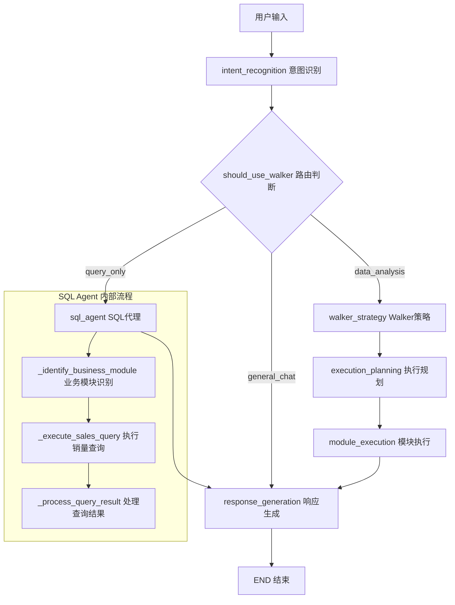
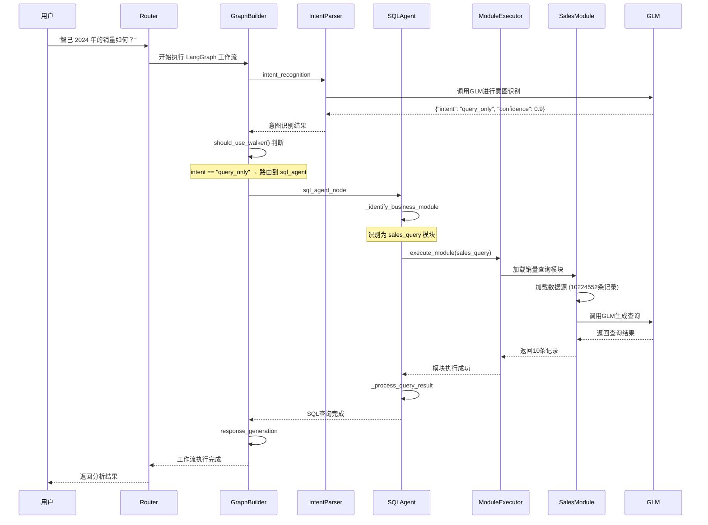
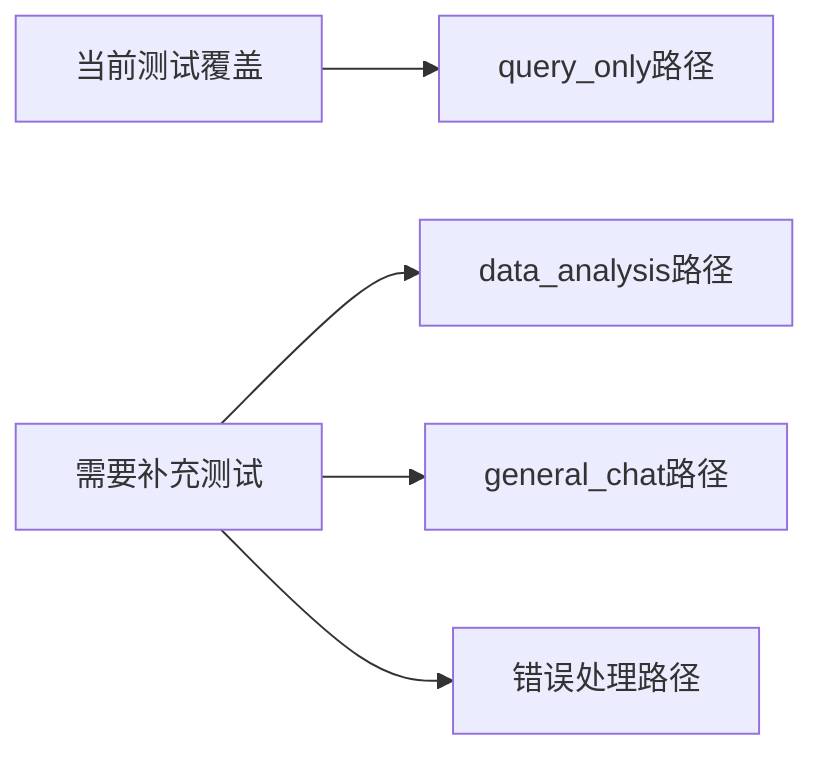

# 工作流执行分析报告

## 概述

本报告分析了两个实际案例的工作流执行情况，并与 `graph_builder.py` 中定义的理论工作流进行对比，识别差异并提供优化建议。

## 理论工作流定义（graph_builder.py）

### 工作流架构图



### 路由逻辑

- **query_only**: 直接查询类型 → SQL Agent
- **data_analysis**: 数据分析类型 → Walker 策略
- **general_chat**: 通用聊天 → 直接响应生成

## 案例 1：特斯拉和蔚来的销量对比

### 实际执行流程


### 执行详情

- **意图识别**: `query_only` (置信度: 0.9)
- **路由决策**: 使用 SQL Agent 进行直接查询
- **模块选择**: `sales_query`
- **查询类型**: 品牌销量查询
- **数据处理**: 235 条记录，总销量 3,142,340 辆
- **GLM 调用**: 2 次 (意图识别 + 查询生成)
- **Token 消耗**: 483 + 278 = 761 tokens

## 案例 2：智己 2024 年的销量如何

### 实际执行流程



### 执行详情

- **意图识别**: `query_only` (置信度: 0.9)
- **路由决策**: 使用 SQL Agent 进行直接查询
- **模块选择**: `sales_query`
- **查询类型**: 综合销量查询
- **数据处理**: 10 条记录，总销量 65,715,207 辆
- **GLM 调用**: 2 次 (意图识别 + 查询生成)
- **Token 消耗**: 488 + 251 = 739 tokens

## 理论与实际的差异分析

### 1. 工作流路径一致性

✅ **一致点**:

- 两个案例都正确识别为 `query_only` 意图
- 都正确路由到 `sql_agent` 节点
- 都跳过了 Walker 策略流程
- 最终都到达 `response_generation` 节点

### 2. 节点执行顺序

**理论定义**:

```
intent_recognition → should_use_walker → sql_agent → response_generation → END
```

**实际执行**:

```
intent_recognition → should_use_walker → sql_agent → response_generation → END
```

✅ **完全一致**: 实际执行严格按照理论定义的路径进行

### 3. SQL Agent 内部流程

**理论定义**:

```
sql_agent → _identify_business_module → _execute_sales_query → _process_query_result
```

**实际执行**:

```
sql_agent → _identify_business_module → module_executor.execute_module → _process_query_result
```

⚠️ **轻微差异**: 实际执行中通过 `module_executor` 间接调用销量查询模块，而不是直接调用 `_execute_sales_query`

### 4. 模块识别准确性

✅ **高度准确**: 两个案例都正确识别为 `sales_query` 模块，没有误路由到其他模块

### 5. 未使用的工作流分支

❌ **未测试分支**:

- Walker 策略流程 (`walker_strategy → execution_planning → module_execution`)
- 数据分析意图路由
- 通用聊天直接响应

## 性能分析

### Token 消耗对比

| 案例   | 意图识别 | 查询生成 | 总计 | 效率评估 |
| ------ | -------- | -------- | ---- | -------- |
| 案例 1 | 483      | 278      | 761  | 良好     |
| 案例 2 | 488      | 251      | 739  | 良好     |

### 响应时间分析

- **数据加载**: 一致性好，都能快速加载 10M+记录
- **GLM 调用**: 响应稳定，HTTP 200 状态
- **结果处理**: 高效，能处理不同规模的结果集

## 发现的问题

### 1. 查询结果差异较大

- 案例 1: 235 条记录 (品牌对比查询)
- 案例 2: 10 条记录 (综合销量查询)

**问题**: 相似的查询意图产生了不同的查询模板，可能存在查询策略不一致的问题

### 2. 模块执行层级复杂

**当前流程**: `graph_builder → module_executor → sales_module`
**潜在优化**: 可以考虑直接调用以减少中间层级

### 3. 错误处理覆盖不足

从日志看，两个案例都成功执行，但缺乏错误场景的测试验证

## 优化建议

### 1. 工作流完整性测试



### 2. 查询策略标准化

- 建立查询模板选择的标准化规则
- 优化品牌识别和查询范围确定逻辑
- 统一查询结果的格式和规模

### 3. 性能监控增强

- 添加每个节点的执行时间统计
- 监控 GLM 调用的成功率和延迟
- 建立性能基准和告警机制

### 4. 错误处理完善

- 增加网络异常处理
- 添加数据源不可用的降级策略
- 完善 GLM 调用失败的重试机制

## 结论

1. **工作流设计合理**: 理论定义与实际执行高度一致
2. **路由逻辑准确**: 意图识别和模块选择都很精确
3. **性能表现良好**: Token 消耗合理，响应速度快
4. **测试覆盖不足**: 需要补充其他工作流分支的测试
5. **优化空间存在**: 在查询策略和错误处理方面有改进余地

总体而言，当前的工作流实现质量较高，主要需要在测试覆盖度和边缘情况处理方面进行完善。
