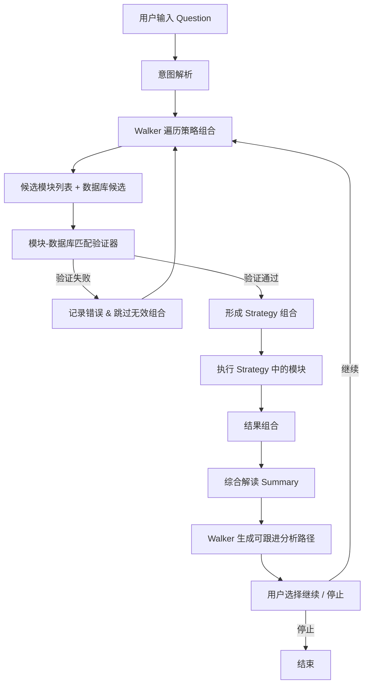

好，那我给你一个 **自动验证所有模块与数据库匹配情况的 Python 检查器** 的雏形，
它会在你每次新增模块或数据库时，自动检测：

- 模块声明的 `supported_databases` 是否存在于系统可用数据库列表
- 模块声明的 `required_fields` 是否在对应数据库模式（schema）中存在
- 如果缺失，会直接打印出问题清单，方便你修复

```python
# tools/module_db_validator.py
import importlib
import pkgutil
from schema import models  # 这里假设你的数据库 schema 信息都定义在 schema/models.py

def get_all_modules(package_name="modules"):
    """动态加载 modules 目录下的所有分析模块类"""
    package = importlib.import_module(package_name)
    for _, modname, ispkg in pkgutil.iter_modules(package.__path__):
        if not ispkg and not modname.startswith("_"):
            yield importlib.import_module(f"{package_name}.{modname}")

def get_database_schema_info():
    """从 schema.models 中读取可用数据库及字段信息"""
    # 假设 models.py 里定义了 DATABASE_SCHEMAS 这样的字典
    # DATABASE_SCHEMAS = {
    #     "car_sales_db": ["brand", "price", "date", "sales"],
    #     "ev_market_db": ["brand", "battery_capacity", "date", "sales"]
    # }
    return getattr(models, "DATABASE_SCHEMAS", {})

def validate_modules_against_databases():
    db_schemas = get_database_schema_info()
    errors = []

    for mod in get_all_modules():
        # 如果模块没有 BaseAnalysisModule 接口，不检查
        if not hasattr(mod, "AnalysisModule"):
            continue

        module_class = mod.AnalysisModule
        supported_dbs = getattr(module_class, "supported_databases", [])
        required_fields = getattr(module_class, "required_fields", [])

        # 1. 检查数据库是否存在
        for db in supported_dbs:
            if db not in db_schemas:
                errors.append(f"[数据库缺失] 模块 {module_class.module_id} 声称支持 {db}，但该数据库不存在")
                continue

            # 2. 检查字段是否完整
            schema_fields = db_schemas[db]
            missing_fields = [f for f in required_fields if f not in schema_fields]
            if missing_fields:
                errors.append(f"[字段缺失] 模块 {module_class.module_id} 在 {db} 缺少字段 {missing_fields}")

    if errors:
        print("❌ 模块-数据库匹配检查失败：")
        for e in errors:
            print("  -", e)
    else:
        print("✅ 所有模块与数据库匹配正常！")

if __name__ == "__main__":
    validate_modules_against_databases()
```

---

### 用法

```bash
python tools/module_db_validator.py
```

运行后它会直接告诉你哪里不匹配，比如：

```
❌ 模块-数据库匹配检查失败：
  - [数据库缺失] 模块 trend_analysis 声称支持 ev_market_db2，但该数据库不存在
  - [字段缺失] 模块 yoy_comparison 在 car_sales_db 缺少字段 ['price_segment']
```

---

我建议你把这个脚本挂到

- **模块新增 / 修改后**
- **数据库 schema 更新后**
- **CI/CD 自动化测试中**

这样，Walker 在运行前就能保证 “模块+数据库” 组合是 **可执行的**，不会执行到一半报错。

---

我可以帮你画一个 **这个验证器在 Walker 架构下的位置流程图**，这样你就知道它是在哪个环节跑的。
要我画吗？这样会更清晰。

那我给你画一个 **Walker 架构下带模块-数据库匹配验证器** 的流程图：



---

🔍 **要点**

1. 验证器位置在 **Walker 确定候选模块+数据库后，但执行前**
2. 如果验证失败，会 **剔除该组合** 并返回 Walker 重新找策略
3. 保证进入执行环节的组合一定是可运行的
4. 在 CI/CD 或本地调试时，也可以用同样的验证器单独跑

---

我建议你把这个验证器**设计成 Walker 的一个可插拔节点**，这样即使将来模块和数据库数百个，它也能在 1-2 秒内筛掉无效的组合。

我可以帮你做一个 **Walker 节点化版本的验证器实现**，直接能嵌到你现有的 `graph_builder.py` 里。
这样它不只是测试脚本，还能在生产流程中跑。
你要我直接给你做这个版本吗？这样 Walker 架构就能一次性打通。
