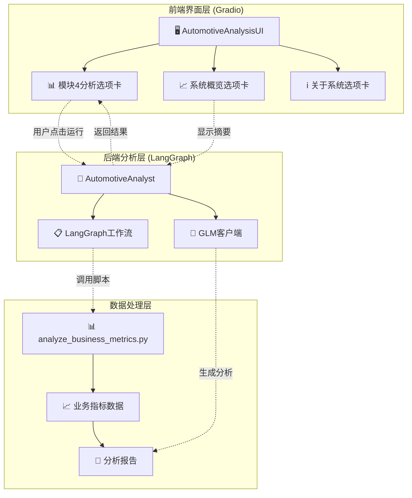
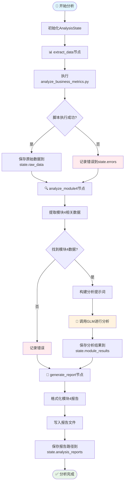
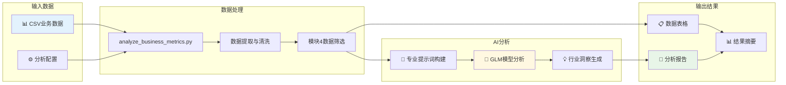
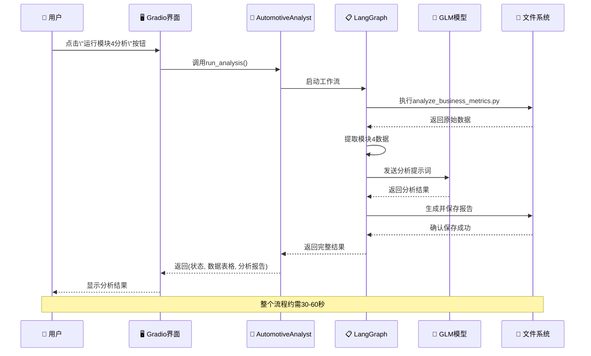
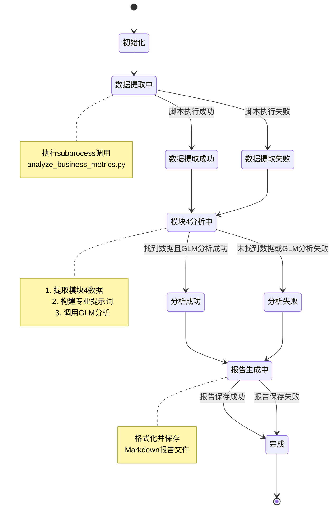

# 汽车行业智能分析系统工作流程图

## 系统架构概览

## LangGraph工作流详细流程

## 数据流图

## Gradio界面交互流程

## 状态管理图

## 关键组件说明

### 1. AutomotiveAnalyst (核心分析引擎)
- **职责**: 协调整个分析流程
- **组件**: GLM客户端、LangGraph工作流
- **状态管理**: AnalysisState TypedDict

### 2. LangGraph工作流节点
- **extract_data**: 数据提取节点，执行业务指标分析脚本
- **analyze_module4**: 模块4分析节点，使用GLM进行专业分析
- **generate_report**: 报告生成节点，格式化并保存分析报告

### 3. AutomotiveAnalysisUI (前端界面)
- **职责**: 提供用户交互界面
- **布局**: 选项卡式界面（模块4分析、系统概览、关于系统）
- **交互**: 按钮点击触发分析，实时显示结果

### 4. 数据流转
1. **输入**: CSV业务数据 → analyze_business_metrics.py
2. **处理**: 原始数据 → 模块4数据筛选 → GLM分析
3. **输出**: 数据表格 + 专业分析报告 + Markdown文件

### 5. 错误处理
- 每个节点都有异常捕获机制
- 错误信息统一收集到state.errors
- 前端界面显示详细错误信息

---

*此图表展示了汽车行业智能分析系统的完整工作流程，包括前端交互、后端处理、AI分析和数据流转的全过程。*